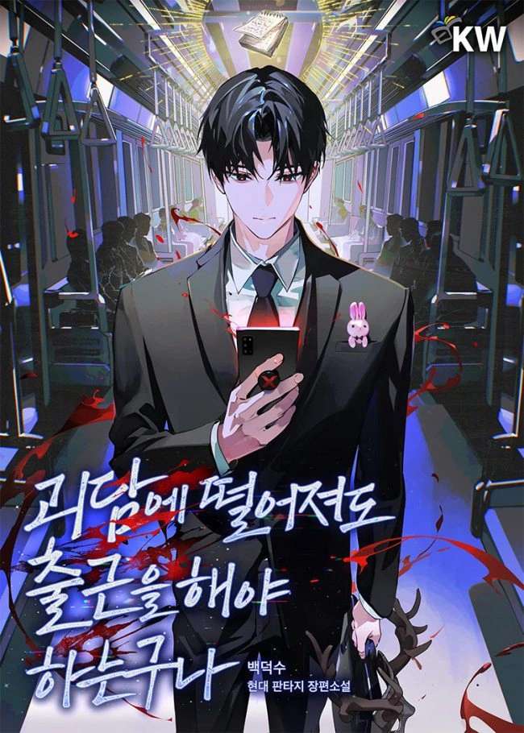

{.hidden-caption fetchpriority="high"}

— URGENT —

Ghost Story Specialist Corporation

Daydream Inc. (Ltd.)

Insane Benefits – Come to Work Immediately

※ Note : The company is not liable for any injuries or fatalities that may occur during the course of the employee’s duties.

——

A pop-up event for some ‘modern fantasy’ media I loved so much that I even took a precious day off work to attend.

On that day, I ended up transmigrating as a character in that very fantasy world.

As none other than a newly hired employee at a famous large corporation!

A dream job with great benefits, an excellent salary, and even kind and competent bosses.

I’m using the information I know about the world to rise through the ranks at lightning speed!

Am I happy, you ask?

Please, just let me go home. I’m begging you.

※ Note : The genre is horror.