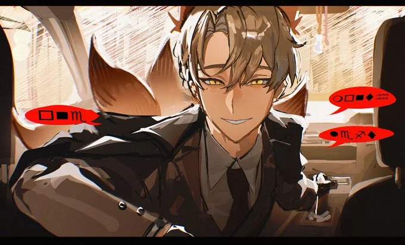
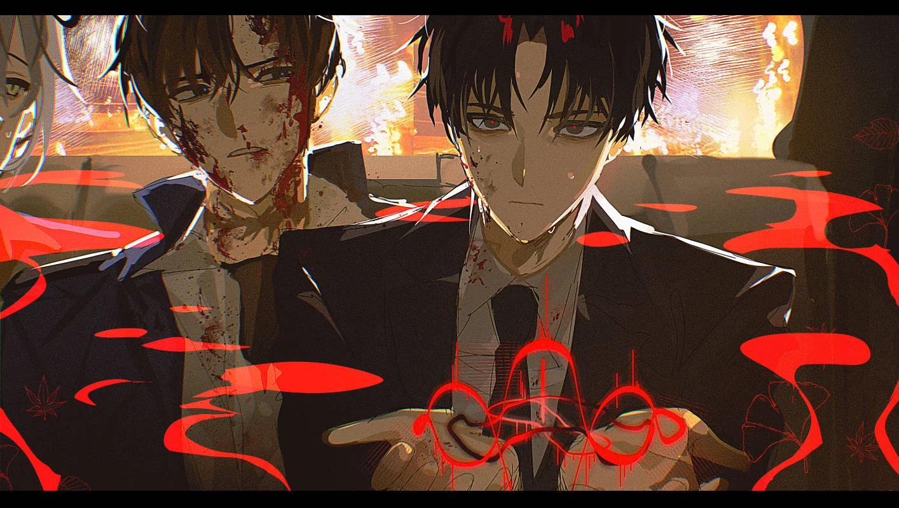

# Chapter 194 - Incantation &  Betrayal

Director Ho’s lips did not move.

But the incantation had begun.

*– Man.*

Rippling circles appeared across Agent Choi’s face.

The smile on his face twisted with the waves.

And the moment he pulled his body back.

*Thud.*

“…!!”

As if one side of his face had collapsed, blood began to pour out.

Chunks of flesh were torn off in the exact shape of the ripples.

No.

“Don’t move. Please don’t move.”

I held on to Agent Choi.

‘He’s doing it to his face, not the back of his hand.’

He was being treated differently than spies.

In other words, move and you die.

Cold sweat ran down my neck.

The incantation continued.

*– You shall never be able to speak of this.*

That.

*– You shall become unable to speak of it.*

The bleeding grew heavier.

Blood flowed over my hands as I gripped Agent Choi’s shoulders.

What could I do?

Director Ho’s spell wasn’t spoken out loud. Even if I tried to speak to him or plead, it wouldn’t stop.

*– Your final appearance shall be as follows.*

If I just held on, wouldn’t I be making it easier, making Agent Choi’s death even swifter and smoother?

I couldn’t help him escape, either. The spell had already begun, and all his equipment… his equipment was all in my tattoo inventory.

‘If only I hadn’t disarmed him.’

No, if only I hadn’t given him that note in the first place.

Maybe even being sent to the glass prison at the last moment would have been better.

But every moment had passed, and now Director Ho continued.

*– Any hint revealed by accident, any change in behavior, any giving of clues is strictly forbidden, and your loss of free will shall never appear on the surface.*

*– Any attempt to reveal the existence of the binding shall fail, and you shall appear no different than before.*

*– Any attempt to change this shall result in punishment.*

‘……’

Is it over?

That sounds like the closing spell, right? So is it just a powerful binding and that’s all?

For a moment, I was relieved.

If I just made it through this, maybe I could figure out another way. At this level, maybe somehow…

*– And tonight.*

The spell was not over.

*– You will resolve to die.*

No.

*– In despair over your fate, you will, in the lowest, filthiest part of this alley, take your own life…*

I lunged forward.

I kicked the back of Director Ho’s seat, grabbed his collar, and shoved him roughly against the steering wheel.

*Beeeeeeep!*

The horn blared madly under the pressure.

That sound drowned out the incantation, shattered his concentration, and broke the oppressive force pressing on the space.

In that instant, the ripples disappeared from Agent Choi’s face.

Panting.

Silence.

…Stillness.

“……”

“……”

“Soleum-nim.”

“……”

“Did you just attack me?”

I let go.

My mouth barely worked.

“You’ve got to stop.”

“……”

“That was the wrong choice.”

It was a crazy choice.

I had just criticized someone unimaginably higher-ranking, someone who’d placed a binding on me and could kill me at any time—a being who might not even be human.

“Aha.”

Director Ho clapped his hands together with a loud smack.

“So you think you know better than me!”

“……”

“You couldn’t even last a quarter after infiltrating, you got exposed to your own team supervisor, and now, without even a word of warning to me, you’re secretly meeting with the Guard Team as a spy!”

I might die.

One wrong step here and I could die.

Director Ho had never shown such direct hostility before. I’m going to die.

But, but…

Still.

“That was your mistake, sir.”

……

“What?”

“From the beginning, the setup was far too sloppy. An infiltrator should never be sent in under their real name.”

Right.

“If you truly thought the Disaster Management Bureau wouldn’t do a background check on their new hires, then as a planner, that was a hopelessly naive decision.”

Unbelievable words came out of my mouth, all directed at someone impossibly above me.

I couldn’t stop.

“Why did you send me in under such easily discoverable conditions? I thought there were other safeguards in place, but it turns out there were none. Did you do this on purpose…”

……

Wait a minute.

“I see.”

I looked at Director Ho.

“You did it on purpose. You wanted me to get caught.”

“……!”

“You sent me in expecting to be discovered from the very beginning. That’s why you had me use my real name, and that’s why you only selected new hires, not veterans.”

You were hoping the inexperienced ones would make mistakes.

Making an easy excuse about ‘outsmarting the Bureau’s detection capabilities’, you deliberately picked the most decent, diligent rookies who’d fit right in at the Bureau.

And there was another side effect to all this.

“The agents who uncover the identities of those infiltrators will become even more confused. After all, there’s no difference in character between them and the real new agents.”

There would be intense debate internally about how to handle them.

And on top of that, everyone would realize that no personality test could filter out a spy, and suspicion would begin to spread among them.

In this way…

“Was it to induce internal strife within the Disaster Management Bureau?”

“……”

“To slowly unravel a tightly knit organization by sowing seeds of distrust, making it so the existing members can’t trust new hires?”

“Soleum-nim, you have a vivid imagination!”

Do I?

“But you’re not directly denying it.”

*Freeze.*

Director Ho stared at me in silence.

“‘I had no such intention, and I swear on the Counseling Room that it’s true.’ …Can you declare that?”

“……”

“I asked if you can make that declaration.”

“Soleum-nim.”

A gentle, friendly smile appeared on Director Ho’s face.

“Even if I did, it wouldn’t change anything.”

“……!”

“There was only ever one promise from the beginning.”

Director Ho raised an index finger.

“If you bring me the documents I asked for, the Wish Ticket will be given. That condition is an absolutely unbreakable guarantee.”

“So.”

My mouth was dry with tension.

My heart was pounding like crazy.

But my mouth moved without hesitation.

“So whether I get caught or not, that’s not actually important. As long as I can get you the ‘documents’.”

“……”

“As long as you get to hear that information.”

Information about an annihilation-sanctioned supernatural disaster.

……

Right.

“In that case, I’ll bring it no matter what.”

“The documents?”

“The information you want.”

“But you’ve already been exposed.”

“Even so.”

I met Director Ho’s gaze.

“I can still bring it.”

And at the same time, I pointed to Agent Choi and subtly shielded him with my body.

“But if this agent dies or becomes incapacitated here, it will be impossible to carry out.”

“And why is that?”

“Because from that point on, I won’t be able to manage the aftermath.”

“……”

“……”

Director Ho kept silently smiling at me.

And I couldn’t look away either. I held on.

And then.

“Very well.”

Director Ho announced.

“Our agreement has not changed. I’m truly looking forward to seeing just how you’ll manage to bring me those documents, Soleum-nim.”

“……”

Relief barely managed to slide down my throat.

“But… you’ll still have to accept your punishment, won’t you?”

……!

“I trust you already know how outrageously rude and inappropriate your actions just now were.”

My eyelids trembled.

“From the start… no one else got caught, so I don’t see how you can claim this wasn’t entirely your own fault.”

A cold wave of dread ran down my spine.

“Excuses are free, but attacking your superior just because your opinion wasn’t accepted was too much… If I were to guess why you went that far.”

“……”

“Did you get attached?”

Cold sweat trickled down my chin.

“Did you get scared of having a fellow agent you worked with die? It seems you’re the type to form precious attachments even in unfamiliar places.”

“Director.”

I replied as calmly as I could.

“For a human being, it’s only natural to be afraid of another person dying.”

“……”

“If you were offended by my rebuttal, I apologize.”

“Oh, not at all! I’m not offended. You’re absolutely right.”

Director Ho smiled again.

“But rules are rules.”

“……”

“Would you hold out your hand? You’ll need to accept your punishment.”

……

Slowly, I extended both hands, just barely keeping them from trembling, palms up.

*– Man.*

Ripples spread.

But unlike the subtle secret binding from before, this was not gentle.

A massive, deep indentation brought a bizarre pain and a twisted sensation to the back of my hand.

“…!”

I clenched my teeth, sweating coldly. Don’t move. If I move…

*– You shall die in one month.*

…!

*– However, if you fulfill your promise with ■■■, this duty shall be revoked.*

*– Any attempt to avoid this shall result in punishment.*

I bit back a scream.

As the ripples faded from the back of my hand, the bizarre sensation and pain slowly disappeared…

“I was worried you might be lying to stall for time. So this time, as you said, I made sure not to be naive!”

Director Ho beamed.

“Thank you for letting me know.”

“……”

I drew my hands back.

For a moment, I met Agent Choi’s trembling gaze.

“Ah. I should get going now.”

“……”

“I only meant to wrap things up quickly, but I didn’t expect such a long chat with you, Soleum-nim.”

“It… didn’t feel like a conversation at all……”

……!!

“You just said… you’ll kill him in a month…”

Sergeant!

‘Don’t say anything, please!’

For the first time, Director Ho seemed to acknowledge the sergeant’s presence and looked at him.

Then… he smiled and spoke.

“Give Director Cheong my regards.”

……!

It was as if Director Ho hadn’t even heard what the sergeant said. He just turned his head back, smiling at me.

“Well then, have a good night, Soleum-nim!”

And with that.

Director Ho disappeared from the driver’s seat.

“……”

“……”

“Director Cheong… will be impossible to meet… Ah, he’s gone.”

I’m alive.

I nearly collapsed onto the taxi floor.

But realizing I was already sitting, I forced my trembling body to move.

The bleeding on Agent Choi’s face was now severe.

I opened up the medical supplies I’d confiscated from Agent Choi and began administering first aid.

“……”

The bleeding on his face stopped, and after some work, he started to stabilize.

Agent Choi didn’t resist.

But he still didn’t speak.

“Agent.”

He just turned his eyes to look at me.

“Don’t think about it.”

“Think about what?”

“Any way to break the binding Director placed on you. Don’t even try to come up with ideas.”

“……”

The first binding Director Ho recited had already been applied to Agent Choi.

Now he could no longer transmit any information about me being a spy, or about what happened today.

He would have to live tomorrow as if nothing had changed from yesterday.

If not.

“You’ll be punished.”

“Punished.”

“Yes.”

I looked up and spoke clearly.

“Whatever is most precious to you will end up meeting the director.”

“……”

Agent Choi quietly took his own medical kit from my hand and continued the first aid himself.

He moved with the practiced skill of someone who’s done this kind of work for a long time.

And then…

“…He’s a director, you said.”

I didn’t answer.

“What kind of binding did the director put on you?”

“……”

“Right now it sounds like he said he’d kill you in a month if you can’t pull off this spy job properly. What did he do to you before?”

I opened the car door.

And nodded my chin toward it.

“Go home.”

“How do you plan to get the information?”

“That’s none of your concern.”

Agent Choi looked at me with an unreadable expression.

“If you tell me what kind of information it is, maybe I can help.”

“That’s not necessary. I’m not going to ask you to steal anything.”

“So what’s the wish you’re trying to fulfill?”

I couldn’t hold it back.

“I just want to go home.”

“……!”

“…I’ll leave your gear in the trunk.”

I got out of the car with the sergeant.

Then I took all of Agent Choi’s equipment and placed it in the trunk, leaving one low-grade Daydream Inc. regeneration potion with it.

I had no idea what kind of talk he’d have to endure showing up to work tomorrow with his face like that.

…While I did that, Agent Choi did not get out of the car.

*Click.*

I closed the trunk roughly and walked away with the sergeant.

…Somewhere.

“……”

“Um… Are you okay…?”

“…Yes.”

The worst was avoided.

Certainly, I’d managed to get through this situation.

One month.

That was enough. I could do it. I have a plan…

I could do it.

“Mm……”

The sergeant spoke in his slow voice.

“Um, if it really gets impossible… come find me…”

“…Thank you.”

Even just the words were a comfort.

I finally pulled myself together.

“Ah, I’m sorry. You always help me out, and I should treat you to something.”

Wasn’t there a bakery nearby? Even if not donuts, I wanted to buy him something, but the sergeant slowly shook his head.

“Mm. Next time… at a good restaurant…”

“…Yes. Next time. For sure.”

A faint laugh escaped me.

…I felt a little lighter.

“Um… and the information I found out…?”

“I’ll hear that next time, too.”

I’m at my limit.

I barely managed a faint smile as I saw the sergeant off.

He looked back at me several times, but in the end, he needed to head back to Daydream Inc. before sundown…

“……”

– Huu, that was suffocating suspense!

I bowed my head.

I looked at the plush doll on my chest.

– Now that your journey has entered a new phase, I can’t wait to see where it will lead next. Don’t you think so, *Friend*?

……

“Think what you want.”

And I took the plush out of my jacket.

For a split second, I felt the urge to throw it onto the main road, but I just stuffed it back in my jacket pocket.

At least I wouldn’t have to hear his voice. At least not today.

“……”

I returned to the old motel I’d been renting for the long term.

And five hours later, I reported for work at the Disaster Management Bureau.

As if nothing had changed.
